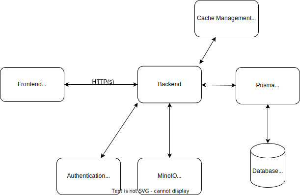

# Application Architecture Overview

This document provides an overview of the application architecture for a project utilizing an NX monorepo structure, Next.js for web development, and NestJS for API development.

## Table of Contents

1. [Introduction](#introduction)
2. [NX Monorepo](#nx-monorepo)
3. [Next.js for Web](#nextjs-for-web)
4. [NestJS for API](#nestjs-for-api)

## Introduction

The application follows a modular architecture built on top of an NX monorepo. This approach allows for efficient code sharing, better organization, and enhanced developer experience. Next.js is utilized for web development, providing server-side rendering capabilities and efficient client-side routing. For the backend, NestJS is chosen for its robustness, TypeScript support, and modular design.

## NX Monorepo

The NX monorepo setup enables the organization of code into multiple projects within a single repository. This facilitates code sharing, dependency management, and consistency across projects. Key features of NX monorepo include:

- **Code Sharing**: Shared libraries, utilities, and components can be easily shared across projects.
- **Consistent Tooling**: Consistent tooling configuration across projects ensures a unified development experience.
- **Efficient Builds**: Smart build system allows for incremental builds, reducing build times for large projects.
- **Dependency Graph**: Visualize dependencies between projects and libraries, aiding in understanding and maintenance.

## Next.js for Web

Next.js is a React framework that provides server-side rendering (SSR), static site generation (SSG), and client-side rendering (CSR) capabilities. It offers efficient client-side routing, automatic code splitting, and a rich ecosystem of plugins and libraries. Key features of Next.js include:

- **Server-Side Rendering**: Pre-rendering pages on the server improves performance and SEO.
- **Client-Side Routing**: Client-side navigation with automatic code splitting for faster page loads.
- **API Routes**: Built-in API routes for serverless functions and backend integration.
- **Static Site Generation**: Generate static pages at build time for improved performance and SEO.
- **TypeScript Support**: First-class TypeScript support for type safety and better developer experience.

## NestJS for API

NestJS is a progressive Node.js framework for building efficient, reliable, and scalable server-side applications. It utilizes TypeScript and follows modular architecture principles inspired by Angular. Key features of NestJS include:

- **Modular Design**: Organize code into modules for better maintainability and scalability.
- **Dependency Injection**: Built-in dependency injection system for managing component dependencies.
- **Middleware Support**: Middleware for processing incoming requests and responses.
- **Decorators**: Use decorators for defining routes, middleware, and other metadata.
- **GraphQL Support**: Built-in support for GraphQL with Apollo integration for building efficient APIs.

## Architecture Overview

Here's a simple architecture overview diagram for the application:



## Folder Structure

```
Root
├── .devcontainer
│   └──devcontainer.json
├── .github
├── .husky
│   └── pre-commit
├── configs
│   └── environment_config.ts
├── docs
├── infra
│   └── cdk.ts
├── packages
│   ├── logger
├── .env.local.example
├── .env.secrets.local.example
├── .gitignore
├── .npmrc
├── .prettierignore
├── cdk.json
├── deploy.sh
├── initLocal.sh
├── package.json
├── nx.json
├── pnpm-lock.yml
├── pnpm-workspace-yaml
├── prettier.config.cjs
├── docker-compose.yml
└── nginx.conf
├── apps
│   ├── api
│   │   ├── prisma
│   │   │   ├── migrations
│   │   │   │   └── init
│   │   │   ├── seeder
│   │   │   └── schema.prisma
│   │   ├── src
│   │   │   └── users
│   │   │       ├── dto
│   │   │       ├── entities
│   │   │       ├── user.controller.spec.ts
│   │   │       ├── user.controller.ts
│   │   │       ├── user.module.ts
│   │   │       └── user.service.ts
│   │   ├── test
│   │   │   └── app.e2e-spec.ts
│   │   ├── package.json
│   │   └── tsconfig.json
│   └── web
│       ├── public
│       ├── package.json
│       ├── tsconfig.json
│       └── src
│           ├── app
│           │   ├── admin
│           │   │   ├── dashboard
│           │   │   │   ├── page.tsx
│           │   │   │   └── index.ts
│           │   │   ├── products
│           │   │   │   ├── page.tsx
│           │   │   │   └── index.ts
│           │   │   └── layout.tsx
│           │   ├── account
│           │   │   ├── index.ts
│           │   │   └── page.tsx
│           │   └── checkout
│           │       ├── index.ts
│           │       └── page.tsx
│           ├── atoms
│           ├── cards
│           ├── modals
│           ├── query
│           ├── hooks
│           ├── services
│           └── middleware.ts

```
